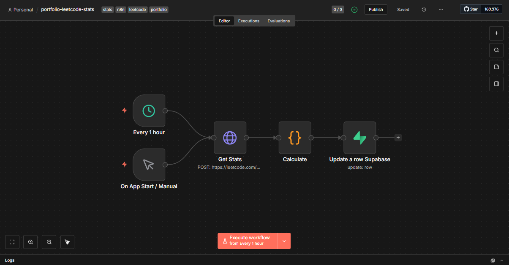

# 🤖 LeetCode Stats Automation with n8n & Supabase


[](https://opensource.org/licenses/MIT)
[](https://ridwansuryantara.netlify.app)

**Automated tracking of LeetCode profile statistics such as problems solved, global ranking, and reputation using n8n with data stored in Supabase.**

## 📖 Overview

This repository hosts an n8n workflow designed to track your coding progress on LeetCode. It runs on a schedule (every 1 hour) to fetch profile data using LeetCode's GraphQL API and updates the statistics in a Supabase database for display on a personal portfolio or dashboard.

## 📸 Workflow Preview



## ✨ Features

* **Automated Scheduling:** Runs automatically every 1 hour or on app start.
* **GraphQL Integration:** Fetches precise data using LeetCode's GraphQL endpoint.
* **Data Aggregation:** Tracks key metrics:
    * ✅ **Problems Solved:** Breakdown of Easy, Medium, Hard, and Total.
    * 🏆 **Ranking:** Global ranking position.
    * 🌟 **Reputation:** Total reputation points.
* **Data Storage:** Processes and updates the corresponding row in **Supabase**.

## 🛠️ Tech Stack

* **Automation:** [n8n](https://n8n.io/) (Self-hosted/Cloud)
* **Database:** [Supabase](https://supabase.com/) (PostgreSQL)
* **Source:** LeetCode GraphQL API

## 🚀 How to Use

### 1. Import Workflow
* Download the `.json` file from this repository.
* Open your n8n editor.
* Click the menu (top right) and select `Import from File`.

### 2. Configure Nodes

Follow the steps below to configure each node with your own LeetCode Username and Database credentials.

#### ⏰ Schedule (Every 1 Hour)
* Set the **Trigger Interval** (e.g., Every 1 Hour) based on how often you want to track data.

#### 🌐 Get Stats (LeetCode GraphQL)
* **Method:** `POST`
* **URL:** `https://leetcode.com/graphql`
* **Headers:** Ensure `Referer` is set to `https://leetcode.com`.
* **Body Configuration:**
    * Look for the **JSON** section in the node.
    * Inside `"variables"`, replace `"riyogs"` with your own **LeetCode Username**.
    ```json
    "variables": {
        "username": "YOUR_USERNAME_HERE"
    }
    ```

#### 🧮 Calculate
* This node extracts the nested GraphQL data into a flat JSON structure.
* It calculates totals for Easy, Medium, and Hard questions.
* *Note:* If your username is invalid, this node will throw a customizable error.

#### 💾 Update a row Supabase
* **Operation:** `Update`
* **Table:** `platform_stats` (or your specific table name).
* **Authentication:**
    * Select **Predefined Credential Type** -> **Supabase API**.
    * Select your credentials.
* **Update Condition:**
    * The workflow is set to update a row where `platform` equals `'leetcode'`.
    * *Important:* Ensure you have a row in your database with the column `platform` set to `leetcode` before running this, or switch the operation to "Upsert".

### 3. Activate
* Toggle the workflow to **Active** in the top right corner.

## 📝 Data Structure

The workflow prepares a JSON object similar to this before sending to Supabase:

```json
{
  "easy": 50,
  "medium": 30,
  "hard": 5,
  "total": 85,
  "ranking": 120450,
  "reputation": 12,
  "platform": "leetcode"
}
